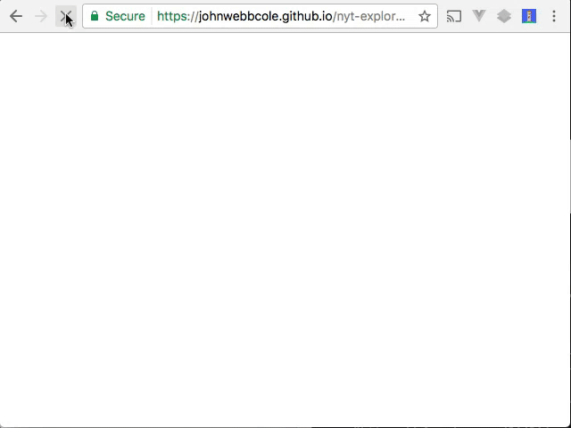

# nytvue

[https://johnwebbcole.github.io/nyt-explorer/](https://johnwebbcole.github.io/nyt-explorer/)

> See the New York Times most popular articles.



## Running

The site is using a 'memory' databae, so reloading the page means you need to refresh your article list.

When you first load the page, you need to reload the articles, press the reload icon in the upper left part of the page.

You can click on each article to see a small preview and from there, continue on to the article on the nyt website.

## Build Setup

``` bash
# install dependencies
npm install

# serve with hot reload at localhost:8080
npm run dev

# build for production with minification
npm run build

# build for production and view the bundle analyzer report
npm run build --report

# run unit tests
npm run unit

# run e2e tests
npm run e2e

# run all tests
npm test
```

For detailed explanation on how things work, checkout the [guide](http://vuejs-templates.github.io/webpack/) and [docs for vue-loader](http://vuejs.github.io/vue-loader).
